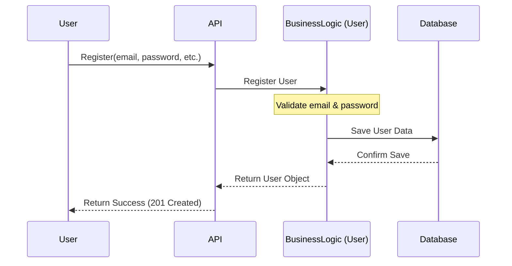

```mermaid

sequenceDiagram

participant User

participant API

participant BusinessLogic as BusinessLogic (User)

participant Database

  

User->>API: Register(email, password, etc.)

API->>BusinessLogic: Register User

Note over BusinessLogic: Validate email & password

BusinessLogic->>Database: Save User Data

Database-->>BusinessLogic: Confirm Save

BusinessLogic-->>API: Return User Object

API-->>User: Return Success (201 Created)

```
