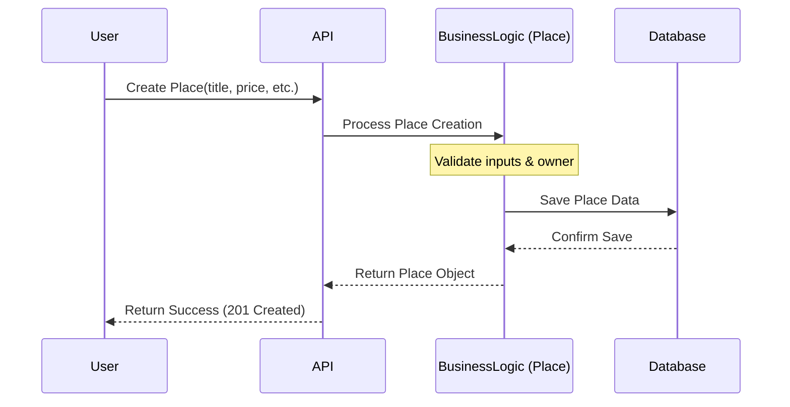

```mermaid
sequenceDiagram
participant User
participant API
participant BusinessLogic as BusinessLogic (Place)
participant Database

User->>API: Create Place(title, price, etc.)
API->>BusinessLogic: Process Place Creation
Note over BusinessLogic: Validate inputs & owner
BusinessLogic->>Database: Save Place Data
Database-->>BusinessLogic: Confirm Save
BusinessLogic-->>API: Return Place Object
API-->>User: Return Success (201 Created)
```
