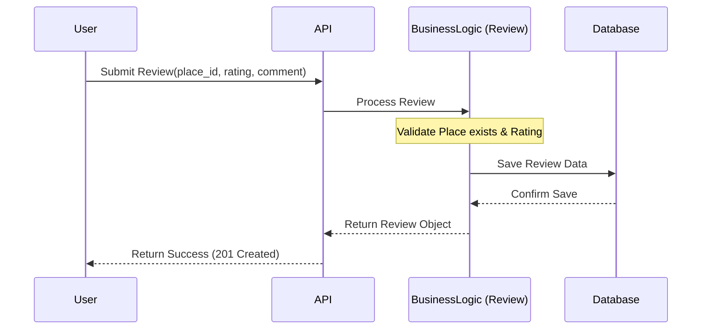

```mermaid
sequenceDiagram
participant User
participant API
participant BusinessLogic as BusinessLogic (Review)
participant Database

User->>API: Submit Review(place_id, rating, comment)
API->>BusinessLogic: Process Review
Note over BusinessLogic: Validate Place exists & Rating
BusinessLogic->>Database: Save Review Data
Database-->>BusinessLogic: Confirm Save
BusinessLogic-->>API: Return Review Object
API-->>User: Return Success (201 Created)
```
